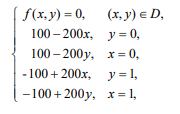

#### Отчёт

Я проводил эскперимент на задаче:

Результаты замеров:

| THREADS_NUMBER | ITERATIONS | TIME   | ACCELERATION |
|----------------|------------|--------|--------------|
| 1              | 365        | 70.559 | 1.00         |
| 2              | 365        | 36.854 | 1.91         |
| 4              | 365        | 26.947 | 2.62         |
| 8              | 365        | 23.063 | 3.06         |
| 12             | 365        | 20.451 | 3.45         |
| 14             | 365        | 19.003 | 3.71         |
| 16             | 365        | 16.977 | 4.16         |

Видно, что практически удалось достичь ratio = __4.52__ (для сетки размера __3000__), которое упоминается в книжке, поэтому можно считать, что алгоритм был реализован эффективно и эксперимент был успешно подтверждён.

Однако если реализовать алгоритм без распараллеливания эффективно (без блоков, без диагоналей), как показано в файле consecutive.cpp, то время будет __55.472__, а значит, абсолютный показатель прироста продуктивности __3.26__.

Это можно интерпретировать по-разному: с одной стороны для __16__ потоков это не такой уж высокий показатель, однако ввиду достаточно специфичесого решения (с неидеальным для кэша обходом массива, непостоянной длиной волны и двуэтапного обновления максимума), такой коэффициент можно считать вполне удовлетворительным.
